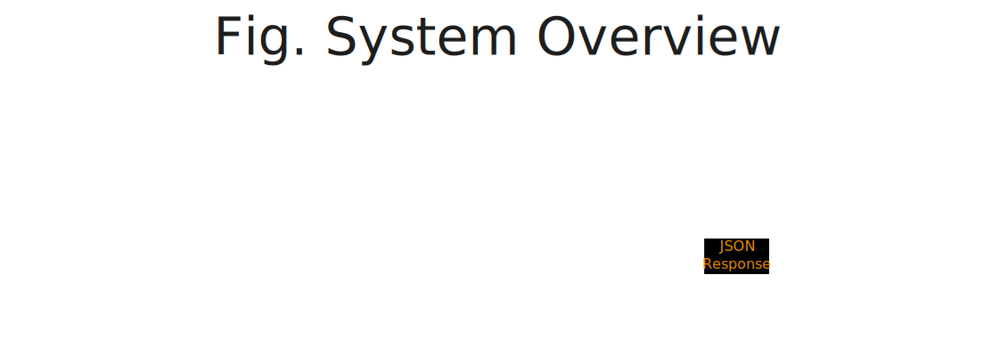
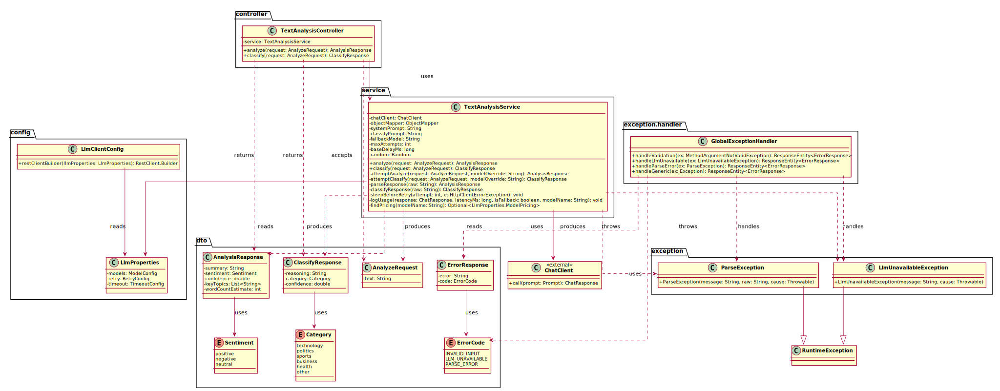
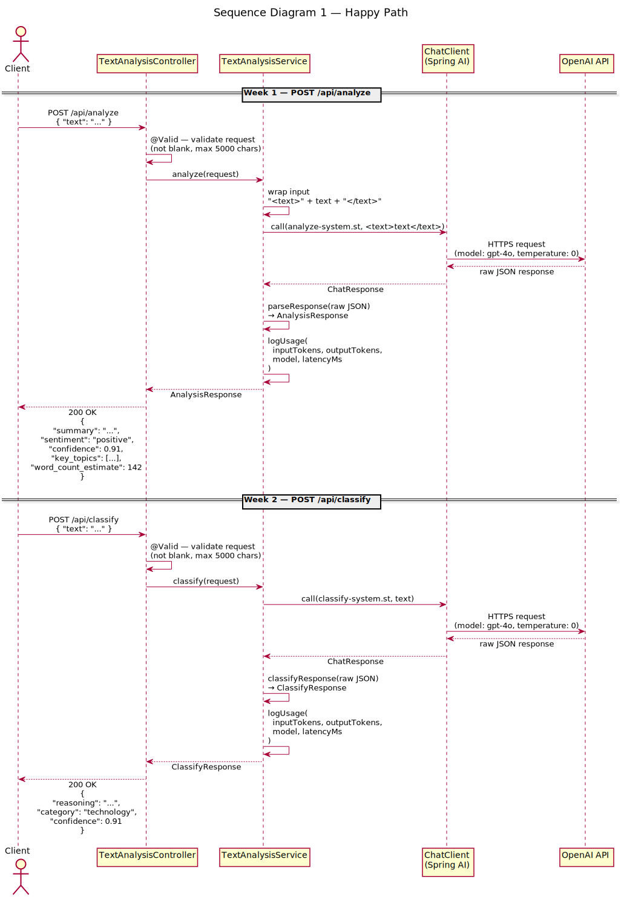
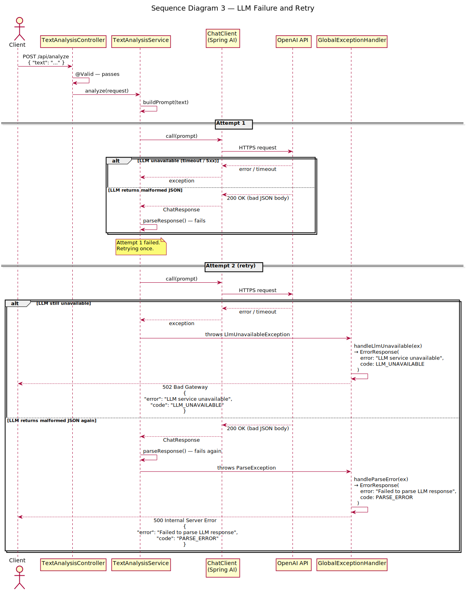
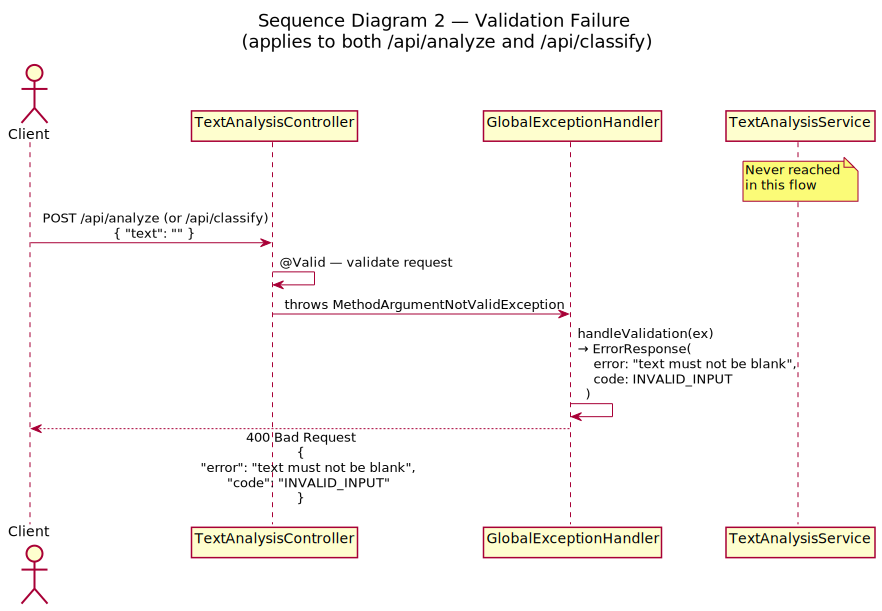

# AI Text Intelligence Dashboard

A full-stack AI application that accepts text input and returns structured intelligence — summarization, sentiment analysis, category classification, streaming analysis, and a stateful multi-turn chat interface.

The goal of this project isn't to build something flashy. It's to make sure every piece of the stack connects properly: prompt → LLM API → validated structured response → frontend display. Getting this foundation right is what makes everything that comes after it easier to build and debug.

---

## Features

| Feature | Description |
| ------- | ----------- |
| Text summarization | Condenses input into a concise two-sentence summary |
| Sentiment analysis | Classifies tone as positive, negative, or neutral with a confidence score |
| Category classification | Identifies the category or topic domain of the text with chain-of-thought reasoning |
| Streaming analysis | Streams LLM tokens to the frontend in real time via Server-Sent Events |
| Stateful chat | Multi-turn chat with full conversation history maintained server-side per session |
| Conversation sidebar | Lists all active conversations with titles and timestamps; supports switching and starting new chats |
| Angular frontend | Tab-based UI with Chat, Analyze, and Classify panels |
| Backend API layer | Spring Boot + Spring AI service that handles all LLM communication — never called directly from the frontend |
| Multi-provider fallback | Automatically routes to a fallback model when the primary is unavailable — transparent to the client |
| Retry with backoff | Exponential backoff with full jitter on LLM failures; respects `Retry-After` on 429 responses |
| Per-request cost tracking | Estimates and logs USD cost per request based on token usage and configured model pricing |

---

## Tech Stack

| Layer | Choice |
| ----- | ------ |
| Frontend | Angular 19 (standalone components, RxJS, signals) |
| Backend | Spring Boot 3.5.x + Spring AI 1.1.6 |
| AI API | OpenAI (gpt-4o primary, gpt-4o-mini fallback) |
| Language | Java 21 (backend), TypeScript (frontend) |

---

## Project Structure

```
ai-text-intelligence-dashboard/
├── backend/
│   └── src/main/java/com/buffden/aitextintelligencedashboard/
│       ├── controller/         # TextAnalysisController, ChatController
│       ├── service/            # TextAnalysisService, ChatService
│       ├── repository/         # ConversationStore (in-memory)
│       ├── dto/                # Request/response DTOs
│       ├── config/             # LlmClientConfig, LlmProperties, ConversationProperties, WebConfig
│       └── exception/          # LlmUnavailableException, ParseException, GlobalExceptionHandler
└── frontend/
    └── src/app/
        ├── core/
        │   ├── models/         # analysis.model.ts, chat.model.ts
        │   └── services/       # llm-stream.service.ts, chat.service.ts
        └── features/dashboard/
            └── components/
                ├── analyze-panel/
                ├── classify-panel/
                ├── stream-result/
                └── chat-panel/
```

---

## Architecture

### System Architecture



### Class Diagram



### Sequence Diagrams

**Happy path — successful analysis request:**



**LLM failure — retry and fallback flow:**



**Validation failure — malformed request rejected before LLM call:**



> Diagrams are authored in Excalidraw (`.excalidraw` files in `docs/`) and auto-exported to SVG via the [`export-excalidraw`](.github/workflows/export-excalidraw.yml) GitHub Actions workflow on every push to main.

---

## Getting Started

### Prerequisites

- Java 21
- Node.js 20+
- An OpenAI API key

### 1. Clone the repo

```bash
git clone <repo-url>
cd ai-text-intelligence-dashboard
```

### 2. Configure the backend

Create a `.env` file in `backend/`:

```
OPENAI_KEY=sk-...
```

### 3. Start the backend

```bash
cd backend
./mvnw spring-boot:run
```

Runs on `http://localhost:8080`.

### 4. Start the frontend

```bash
cd frontend
npm install
npm start
```

Runs on `http://localhost:4200`.

---

## API Reference

### `POST /api/analyze`

Full structured analysis of the input text.

**Request:**
```json
{ "text": "Your input text here" }
```

**Response:**
```json
{
  "summary": "A two-sentence summary of the text.",
  "sentiment": "positive | negative | neutral",
  "confidence": 0.87,
  "key_topics": ["topic1", "topic2"],
  "word_count_estimate": 142
}
```

---

### `POST /api/classify`

Category classification with chain-of-thought reasoning.

**Request:**
```json
{ "text": "Your input text here" }
```

**Response:**
```json
{
  "reasoning": "The text discusses AI investment and automation, which maps to technology.",
  "category": "technology | politics | sports | business | health | other",
  "confidence": 0.91
}
```

---

### `GET /api/analyze/stream?text=...`

Streams the LLM analysis response token-by-token as Server-Sent Events.

**Events:**
| Event name | Data |
| ---------- | ---- |
| *(default)* | A single token string |
| *(default)* | `[DONE]` — signals stream completion |
| `error` | Error message string |

---

### `POST /api/chat/stream`

Streaming multi-turn chat. Maintains conversation history server-side.

**Request:**
```json
{
  "conversationId": "uuid-from-client-or-null",
  "message": "What is the sentiment of this article?"
}
```

**SSE Events:**
| Event name | Data |
| ---------- | ---- |
| `conversation-id` | The server-assigned conversation UUID (sent before any tokens) |
| *(default)* | A single token string |
| *(default)* | `[DONE]` — signals stream completion |
| `error` | Error message string |

---

### `GET /api/chat/{conversationId}/history`

Returns the full message history for a conversation. Used by the frontend to restore a session on page reload.

**Response:**
```json
[
  { "role": "user", "content": "What is the sentiment of this article?" },
  { "role": "assistant", "content": "The article has a predominantly positive sentiment..." }
]
```

---

### `GET /api/chat/conversations`

Returns all active conversations as summaries, sorted newest-first.

**Response:**
```json
[
  {
    "id": "uuid",
    "title": "What is the sentiment of this...",
    "createdAt": "2025-01-01T10:00:00Z",
    "messageCount": 4
  }
]
```

---

## Configuration

All tunable values are in `backend/src/main/resources/application.yaml`.

| Key | Default | Description |
| --- | ------- | ----------- |
| `app.llm.models.primary.name` | `gpt-4o` | Primary model |
| `app.llm.models.fallback[0].name` | `gpt-4o-mini` | Fallback model |
| `app.llm.retry.max-attempts` | `3` | Max LLM call attempts |
| `app.llm.retry.base-delay-ms` | `1000` | Base delay for exponential backoff |
| `app.llm.timeout.connect-ms` | `5000` | HTTP connect timeout |
| `app.llm.timeout.read-ms` | `30000` | HTTP read timeout |
| `app.conversation.max-messages` | `20` | Sliding window size per conversation |
| `app.conversation.expiry-seconds` | `3600` | Conversation TTL (1 hour) |

---

## What This Project Covers

- Writing system prompts that enforce structured JSON output reliably
- Few-shot prompting to improve classification consistency across categories
- Using a reasoning scratchpad inside JSON output for chain-of-thought classification
- Hardening prompts against injection using input delimiters and explicit role instructions
- Validating and parsing LLM responses before trusting them
- Handling API errors, rate limits, and malformed responses
- Logging token usage and estimated cost per request
- Building a proper backend service layer — LLM is a component, not the whole app
- Multi-provider fallback — routing to a secondary model on primary failure without changing the API contract
- Config-driven provider selection — switching models requires only an `application.yaml` change, no code changes
- Exponential backoff with full jitter — retry delays grow between attempts and are randomised to prevent thundering herd
- `Retry-After` header support — on 429 responses the server-specified delay is used instead of the calculated backoff
- Connect and read timeouts — externalized to config, wired into the HTTP client so hung LLM calls fail fast
- SSE streaming — backend uses `SseEmitter` + Spring AI `stream().content()` Flux; frontend consumes via Fetch API + `ReadableStream` wrapped in an RxJS Observable
- Stateful conversation management — in-memory `ConcurrentHashMap` with sliding window truncation, TTL expiry, and scheduled cleanup
- `localStorage` session persistence — active conversation ID survives page reload and is validated against live server state on init
